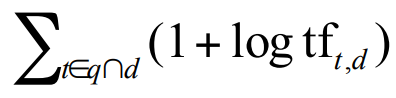
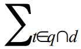
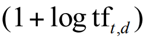

# Uke 6

## Ranked retrieval

Et av problemene med boolske spørringer er at resultatene ikke nødvendigvis er relevante for brukeren. En boolsk spørring på mail-inboksen går bra, men å alltid få opp de nyeste dokumentene på Google er ikke nødvendigvis like fornuftig. Istedenfor kjører vi _ranked retrieval_, der dokumenter blir rangert etter relevans!

## Tf-idf
Intuisjonen bak tf-idf er å belønne ord som forekommer ofte i et dokument, men også sjelden i andre dokumenter. Et ord er trolig mer informativt hvis det bare dukker opp i noen få dokumenter fra corpuset, og dokumentet er sannsynligvis mer relevant hvis ordet forekommer mange ganger!

#### Term-frekvens

Det blir for simpelt å _bare_ se på frekvens. Et dokument der spørringen forekommer 10 ganger _er_ mer relevant enn et dokument der spørringen forekommer 1 gang, men ikke 10 ganger mer relevant! Et alternativ er å ta logaritmen av antall forekomster + 1!

> **Quick maths:** \
> 1 + log10(1) = 1 \
> 1 + log10(2) = 1.3 \
> 1 + log10(10) = 2 \
> 1 + log10(1000) = 4

Scoren for et dokument-spørring-par blir gitt med **log frequency weighting**, og vises med denne formelen:

Skummelt! La oss bryte opp formelen :)

Dette betyr

> Summen av verdiene til alle termene (t) som forekommer i spørringen (q) og dokumentet (d)

Verdiene til termene beregnes slik:

Noen av verdiene kan sees i "quick maths"-seksjonen. tft,d betyr: antall forekomster av termen **t** i dokumentet **d**. så tar man logaritmen av det, legger til 1.

Dette gjøres for alle termene, og summen av verdiene legges til dokumentet.

#### Dokument-frekvens

Noen ganger er det ikke forekomsten av ordet som har så mye å si, men heller _hva slags ord det er snakk om_! For eksempel, hvis en spørring er

> the arachnocentric person

så er nok dokumenter som inneholder "arachnocentric" mye mer relevant enn dokumenter som inneholder "the"!

dft er **dokument-frekvensen** til t: Antall dokumenter t forekommer i. For å finne ut hvor sjeldent et ord er, kan vi _inversere_ dokument-frekvensen!

Vi beregner idft slik:

> log10(N/df)

der N er antall dokumenter vi har totalt i korpuset.

Si at dette er noen ord i korpuset, der "the" er ordet som forekommer oftest:

| term      | dft |
| --------- | -------------- |
| the       | 1 000 000      |
| under     | 10 000         |
| fly       | 1 000          |
| sunday    | 100            |
| animal    | 10             |
| calpurnia | 1              |

Formelen vår gir termene følgende idft:

| term      | dft | idft |
| --------- | -------------- | --------------- |
| the       | 1 000 000      | 0               |
| under     | 100 000        | 1               |
| fly       | 10 000         | 2               |
| sunday    | 1 000          | 3               |
| animal    | 100            | 4               |
| calpurnia | 1              | 6               |

Og dermed vil et dokument som inneholder "calpurnia" mye bli vektet høyere enn et dokument som inneholder "the" mange ganger.

Det gir ikke mening å se på idf for spørringer med bare ett term, fordi poenget med idf er å stille termene i spørringen opp mot hverandre! Hvis spørringen er

> the calpurnia

og vi har disse to dokumentene:

> the calpurnia, my calpurnia!

> the calpurnia, and the other stuff that the shakespeare guy talked about

så vinner dokument 1, fordi det inneholder en "the" og to "calpurnia", som er mer verdt enn dokument 2 sine tre "the" og bare én "calpurnia".

Nå som vi vet hvordan vi regner tft,d, og idft, kan vi slå dem sammen for å vekte dokumentene våre!

Konseptet kalles _tf-idf_, der man ganger resultatet av tf og idf. Det er faktisk det dere skal gjøre i [Assignment D-1](https://github.com/aohrn/in3120-2024/blob/main/assignment-d-1.md)! :)

La oss prøve med de to dokumentene over!

> the calpurnia, my calpurnia!

tfthe, doc1 = 1 + log10(tft,d) = 1 + log10(1) = 1 + 0 = 1 \
idfthe = 0 \
tf-idfthe, doc1 = 1 x 0 = 0

tfcalpurnia, doc1 = 1 + log10(tft,d) = 1 + log10(2) = 1 + 0.3 = 1.3 \
idfcalpurnia = 6 \
tf-idfcalpurnia, doc1 = 1.3 x 6 = 7.8

Scoren til dokument 1 blir altså 0 + 7.8 = 7.8

> the calpurnia, and the other stuff that the shakespeare guy talked about

tfthe, doc2 = 1 + log10(tft,d) = 1 + log10(3) = 1 + 0.47 = 1.47 \
idfthe = 0 \
tf-idfthe, doc2 = 1.47 x 0 = 0

tfcalpurnia, doc2 = 1 + log10(tft,d) = 1 + log10(1) = 1 + 0 = 1 \
idfcalpurnia = 6 \
tf-idfcalpurnia, doc2 = 1 x 6 = 6

Scoren til dokument 2 blir altså 0 + 6 = 6

Og dermed vinner dokument 1 :)

tf-idf-scoren øker både med antall forekomster, og hvor sjeldne ordene er!

### Collection frequency

Korpus-frekvens kan også si noe om hvor viktig et ord er for dokumentet. Se for eksempel her:

| Ord         | Collection freq | Document freq |
| ----------- | --------------- | ------------- |
| Informatikk | 10440           | 3997          |
| Gøy         | 10442           | 8760          |

"Informatikk" og "gøy" forekommer ca. like ofte i korpuset, men "informatikk" forekommer i mange færre dokumenter! Det betyr at det nevnes oftere når det først er med, og er antakeligvis et ord som er ganske sentralt i de dokumentene det forekommer i.
