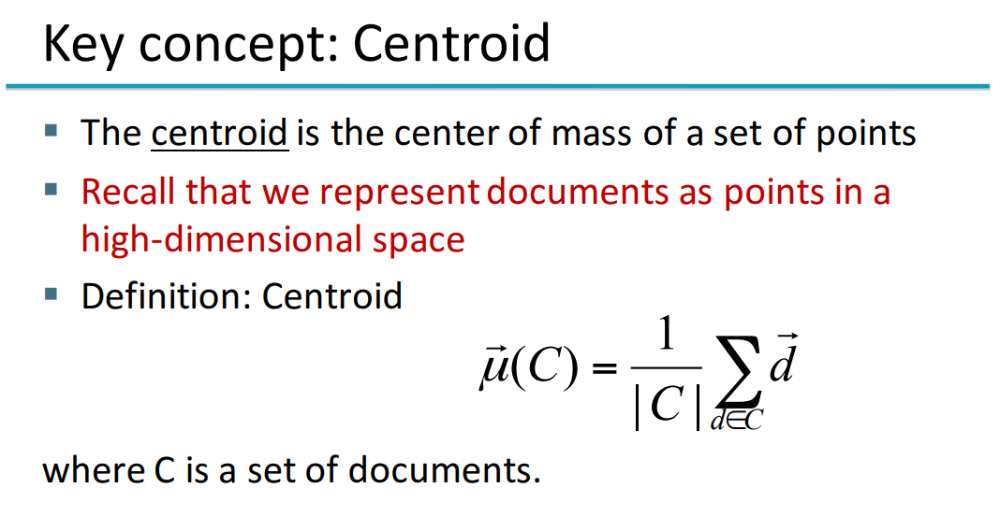
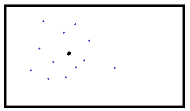
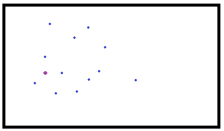
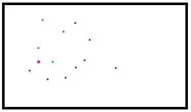
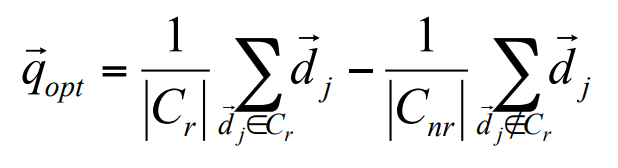
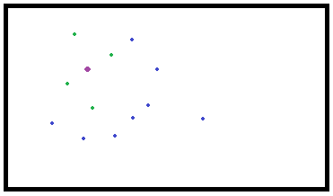
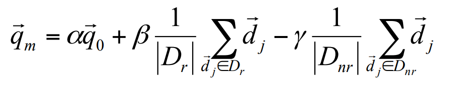

# Uke 8

### Rocchio-algoritmen

Her er hovedkonseptet at dokumentene ligger i et vektor-rom, også beregner vi gjennomsnittet av vektene deres.

I forelesningen så vi den skumle Sentroide-formelen:



Den kan også forklares slik: **gjennomsnittet av vektorene** (summen av vektorene, delt på antall vektorer) :)

Det kan også visualiseres ca. slik:



De blå prikkene er dokumenter, og den sorte prikken er sentroiden. Den ligger i "midten" av de blå prikkene :)

#### Men hvordan fungerer det i praksis?

I utgangspunktet vet vi ikke hvilke av dokumentene som er relevante eller irrelevante. Vi sender av gårde en spørring, som blir plassert et sted i vektor-rommet:



Den lilla flekken er spørringen vår, og dokumentene i nærheten er side 1 av Google. Vi kan tenke at dokumentet helt til høyre ligger på side 2-3, for eksempel.

Gjennom relevance feedback markerer vi noen dokumenter som relevante, f.eks. slik:



De grønne prikkene er "relevante" dokumenter. Da kan vi bruke denne, igjen, kjempeskumle, formelen:



Den sier egentlig: Ta differansen av sentroiden av de relevante dokumentene R, og sentroiden av de irrelevante dokumentene NR, og bruk resultatet til å produsere en ny "spørring", istedenfor den brukeren opprinnelig ga oss:



Formelen som brukes i praksis (fra 1971) jobber med litt flere variabler:



Med andre ord:

```python
refined_query =
      alpha * spørringen vår
    +  beta * sentroiden av relevante dokumenter
    - delta * sentroiden av irrelevante dokumenter
```

Alpha, beta og delta er variabler som brukes for å tweake den nye spørringen! Ofte er beta, variabelen som fokuserer på relevante dokumenter, den viktigste å øke. Noen søkemotorer har default delta=0, fordi det er såpass dyrt å ha med negative resultater.

